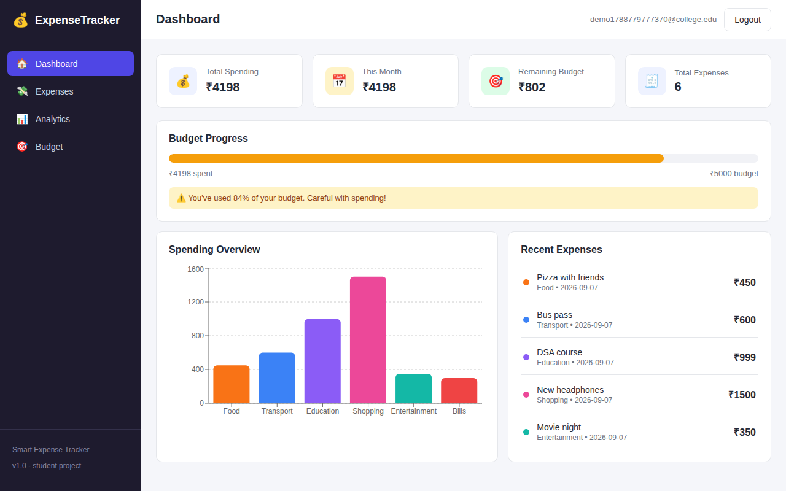
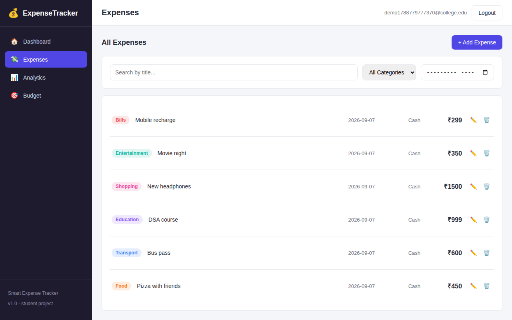
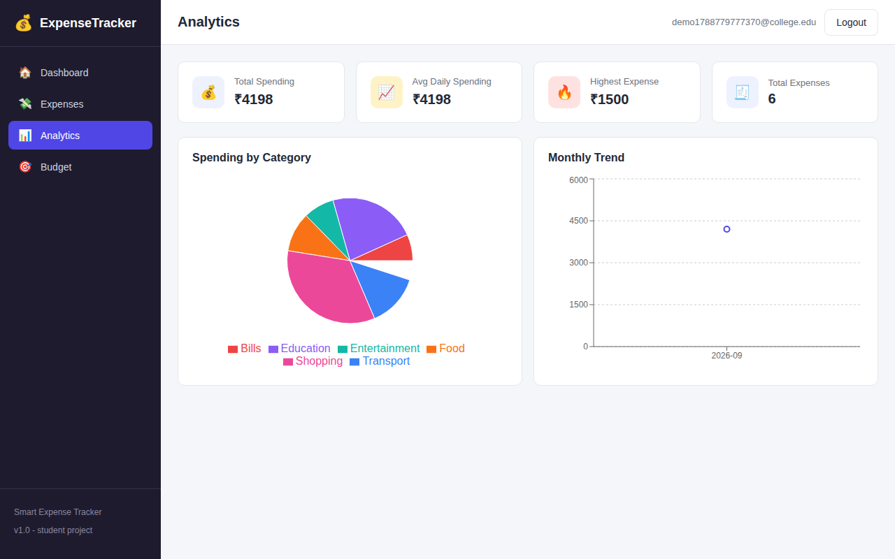
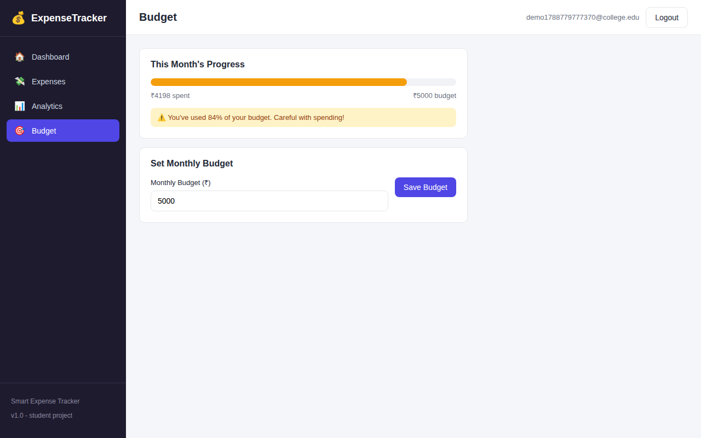
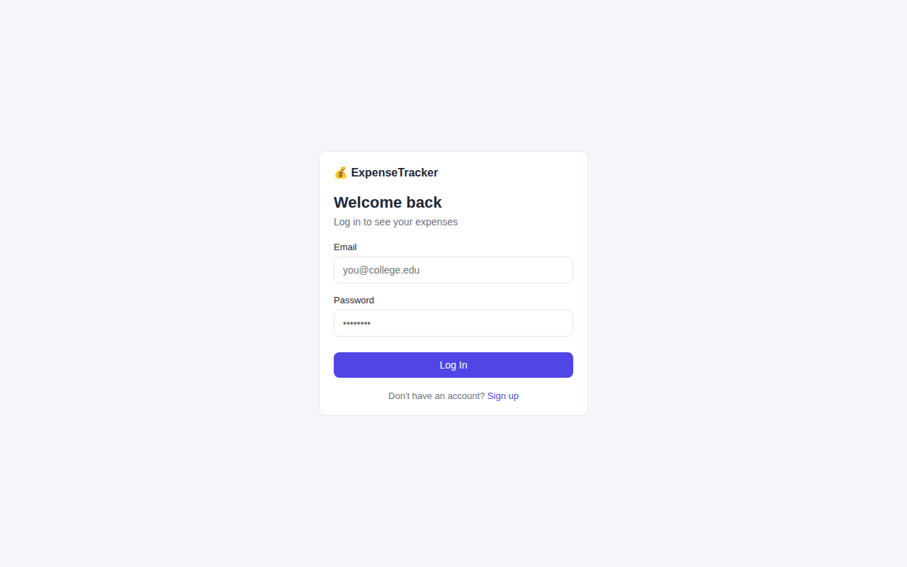
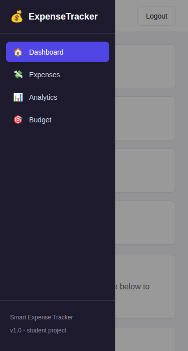

# Smart Expense Tracker

This is my expense tracker project for college. Basically it lets you add your
daily expenses, put them into categories, set a monthly budget and see some
charts about your spending. Each user has their own account and only sees
their own expenses.

Made this to practice full stack dev - React on frontend and FastAPI on the
backend, with SQLite as the database (no need to set up a server for the db,
its just a file).

## Screenshots

**Dashboard**


**Expenses (with search/filter)**


**Analytics**


**Budget**


**Login**


**Mobile view**



## Features

- 📊 **Dashboard** - total spending, this month's spending, remaining budget,
  budget progress bar, spending chart, recent expenses
- 💸 **Expenses** - add / edit / delete, each with title, amount, category,
  date, description and payment method
- 🔍 **Search & filters** - search by title, filter by category, filter by
  month
- 📁 **CSV export** - download all your expenses as a `.csv` file
- 📈 **Analytics** - total/average-daily/highest spending, category
  breakdown (pie chart), monthly trend (line chart)
- 🎯 **Budget** - set a monthly limit, see progress, get warned at 80% used
  and again if you go over
- 🔐 **Auth** - register/login/logout, each user only sees their own data
- 📱 Responsive - works on mobile too (sidebar becomes a slide-over menu)

## Tech Stack

**Frontend**
- React (Vite)
- React Router
- Axios
- Recharts (charts)
- Plain CSS (no UI framework, just CSS variables for consistent theming)

**Backend**
- Python
- FastAPI
- SQLite + SQLAlchemy
- JWT auth (python-jose + bcrypt)
- Pytest for tests

## Project Structure

```
jatin4114/
├── backend/
│   ├── app/
│   │   ├── main.py        # fastapi app starts here
│   │   ├── routes/        # api endpoints
│   │   ├── models/        # db models (sqlalchemy)
│   │   ├── schemas/       # pydantic schemas (request/response shapes)
│   │   ├── services/      # business logic
│   │   ├── database/      # db connection/session stuff
│   │   └── auth/          # login/register/jwt stuff
│   ├── tests/              # pytest suite
│   └── requirements.txt
├── frontend/
│   └── src/
│       ├── api/            # axios calls to the backend
│       ├── components/      # reusable UI pieces
│       ├── context/          # AuthContext
│       ├── pages/            # one component per route
│       └── utils/             # categories list, payment methods etc
├── docs/
│   ├── API.md               # api reference
│   ├── ARCHITECTURE.md       # how the project is put together + why
│   └── screenshots/
└── README.md
```

See [docs/ARCHITECTURE.md](docs/ARCHITECTURE.md) for more details on how
everything fits together, and [docs/API.md](docs/API.md) for the full api
reference.

## How to run it

### Backend

```bash
cd backend
python3 -m venv venv
source venv/bin/activate      # on windows: venv\Scripts\activate
pip install -r requirements.txt
cp .env.example .env
uvicorn app.main:app --reload
```

backend runs at http://127.0.0.1:8000
interactive api docs (swagger) at http://127.0.0.1:8000/docs

### Frontend

```bash
cd frontend
npm install
cp .env.example .env
npm run dev
```

frontend runs at http://127.0.0.1:5173

### Running tests

```bash
cd backend
source venv/bin/activate
pytest -v
```

23 tests covering auth, expense CRUD, budget, and analytics
calculations (all passing).

## Notes

- The database is a local SQLite file (`backend/expense_tracker.db`) -
  it gets created automatically the first time you run the backend,
  and it's gitignored since this project isn't meant to be deployed.
- If you change any of the SQLAlchemy models, easiest thing is to just
  delete the `.db` file and restart the server - it'll recreate the
  tables fresh (no migrations set up, see
  [docs/ARCHITECTURE.md](docs/ARCHITECTURE.md) for why).
